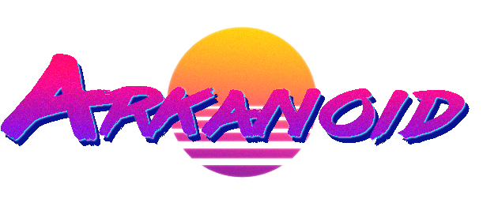

# Arkanoid 3D

> A 3D Arkanoid/Breakout game written in **bare WebGL 2.0** — zero dependencies, zero build tools.

<p align="center">
  
</p>

Built entirely with vanilla JavaScript and WebGL 2.0, this game delivers a retro-futuristic vaporwave experience with real-time 3D rendering, dynamic lighting, and cinematic camera controls.

---

## ✨ Features

- **3D Vaporwave Aesthetic** — Point-light Phong shading with neon color palette and animated starfield
- **Physics-Based Gameplay** — Sub-stepped collision detection, paddle hit-position angle control, progressive ball acceleration
- **Cinematic Camera** — 5 preset views with smooth transitions, screen shake effects, dynamic ball tracking
- **Persistent Settings** — Difficulty, grid size, and FOV saved to localStorage
- **Zero Build System** — Open the HTML file in any browser with WebGL 2.0 support
- **Docker Ready** — Deploy as a static HTTP server

---

## 🎮 Controls

| Input | Action |
|---|---|
| 🖱️ **Mouse move** | Move paddle |
| 🖱️ **Left click** | Launch ball / Restart on game over |
| 🔄 **Scroll wheel** | Zoom in / out (Field of View) |
| **1 – 5** | Switch camera preset view |

### Camera Presets

| Key | View | Description |
|---|---|---|
| `1` | **Default** | Classic top-down 45° view (original camera) |
| `2` | **Top-Down** | Almost overhead, full arena overview |
| `3` | **Side View** | Cinematic side angle |
| `4` | **POV Paddle** | Close-up behind the paddle |
| `5` | **Dynamic** | Camera follows the ball with trajectory anticipation |

---

## 🚀 Quick Start

### Option A: Python HTTP Server

```bash
python3 -m http.server 8080
```

Open `http://localhost:8080` in your browser.

### Option B: Docker

```bash
docker build -t arkanoid-3d .
docker run -p 8080:80 arkanoid-3d
```

### Option C: Any Static Server

Simply serve the project directory with any HTTP server (Apache, Nginx, XAMPP, etc.).

> ⚠️ **Note:** Opening `index.html` directly via `file://` protocol will not work — WebGL shader loading requires an HTTP server.

---

## 📁 Project Structure

```
Arkanoid-3D/
├── index.html              # Entry point
├── Dockerfile              # Apache httpd container
├── assets/                 # Audio, images, SVG icons
├── css/
│   ├── style.css           # Main stylesheet
│   ├── space.css           # CSS animated starfield
│   └── font.css            # Roboto Mono font
├── shaders/
│   ├── vs.glsl             # Vertex shader (GLSL 300 es)
│   └── fs.glsl             # Fragment shader (Phong + vaporwave)
├── js/
│   ├── app.js              # Root namespace (APP)
│   ├── config.js           # Centralized game configuration
│   ├── vendor/
│   │   └── twgl.js         # TWGL — Tiny WebGL library
│   ├── core/
│   │   ├── math.js         # 3D linear algebra
│   │   ├── shaders.js      # Shader compilation & linking
│   │   ├── texture.js      # Texture utilities
│   │   ├── geometry.js     # Sphere & cube mesh generators
│   │   ├── coordinates.js  # 2D game → 3D world mapping
│   │   └── storage.js      # localStorage persistence
│   ├── game/
│   │   ├── colors.js       # Randomized vaporwave palette
│   │   ├── arena.js        # Arena builder (ball, paddle, walls, blocks)
│   │   ├── state.js        # Game state machine
│   │   ├── physics.js      # Physics engine (collisions, bounce, sub-stepping)
│   │   └── input.js        # Mouse & keyboard input handling
│   ├── render/
│   │   ├── camera.js       # Cinematic camera (orbit, presets, shake)
│   │   └── renderer.js     # WebGL renderer (init, scene, draw loop)
│   └── ui/
│       └── menu.js         # Main menu & settings panel
└── plans/
    ├── refactor-plan.md    # Initial codebase analysis & refactor plan
    └── evolutive-plan.md   # Feature evolution plan (physics, camera, storage)
```

---

## 🧱 Architecture Overview

The application follows a **namespaced modular pattern** — all modules live under the single global `APP` object.

```
APP
├── .config          ← Centralized constants & settings
├── .math            ← 3D matrix/vector math
├── .shaders         ← WebGL shader utilities
├── .texture         ← Texture loading
├── .geometry        ← Procedural mesh generation
├── .coordinates     ← Coordinate system mapping
├── .storage         ← localStorage persistence
├── .colors          ← Palette management
├── .arena           ← Game object factory
├── .game            ← State machine (start / play / end)
├── .physics         ← Physics engine
├── .input           ← Mouse & keyboard handling
├── .camera          ← Cinematic camera system
├── .renderer        ← WebGL rendering pipeline
└── .ui              ← DOM-based user interface
```

---

## 🛠️ Development

### Requirements

- A modern browser with **WebGL 2.0** support
- An HTTP server (Python, Docker, Apache, etc.)
- No npm, no build step, no dependencies

### Scripts

All 16 JavaScript modules are loaded via `<script>` tags in `index.html`. Load order respects module dependencies.

### Physics Engine

The ball uses **circle vs AABB** collision detection with **sub-stepping** (max 0.05 units per step) to prevent tunneling. The paddle bounce angle is dynamically calculated based on where the ball hits:

| Hit position | Bounce angle |
|---|---|
| Left edge (−1) | ~155° (up-left) |
| Center (0) | 90° (straight up) |
| Right edge (+1) | ~25° (up-right) |

Paddle velocity is partially transferred to the ball, giving the player directional control.

---

## 📜 License

MIT — feel free to use, modify, and share.

---

<p align="center">
  <sub>Built with ❤️ and vanilla WebGL 2.0</sub>
</p>